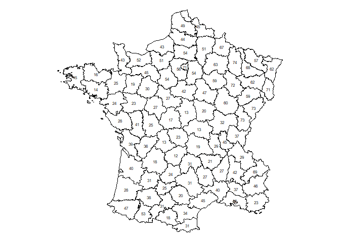
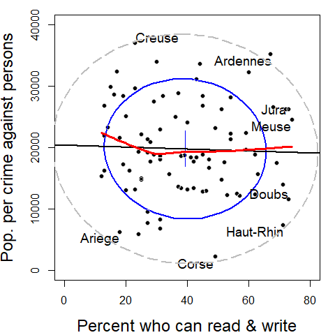

<!-- README.md is generated from README.Rmd. Please edit that file -->
<!-- badges: start -->

[](https://www.tidyverse.org/lifecycle/#stable)
[](https://cran.r-project.org/package=Guerry)
[](https://cran.r-project.org/package=Guerry)
[](https://zenodo.org/badge/latestdoi/133678938)
[](https://github.com/friendly/Guery)

<!-- badges: end -->

# Guerry 

**Version**: 1.8.3

The `Guerry` package comprises maps of France in 1830, multivariate data
from A.-M. Guerry and others, and statistical and graphic methods
related to Guerry’s *Moral Statistics of France*. The goal is to
facilitate the exploration and development of statistical and graphic
methods for multivariate data in a geo-spatial context of historical
interest.

The package stems from [Friendly
(2007)](https://www.datavis.ca/papers/guerry-STS241.pdf). For a history
of André-Michel Guerry and his work, see Friendly (2022), [*The Life and
Work of André-Michel Guerry,
Revisited*](https://www.datavis.ca/papers/guerryvie/GuerryLife2-SocSpectrum.pdf).

This figure shows a reproduction of six choropleth maps Guerry used to
discuss the relations among the main “moral variables”. All of these are
scaled so that more is better. Guerry asked, do such patterns reflect
simply individual behavior, or are there laws to be discovered in his
data?


## Installation

You can install Guerry from CRAN or the development version as follows:

| Version | Command                                      |
|:--------|:---------------------------------------------|
| CRAN    | `install.packages("Guerry")`                 |
| Devel   | `remotes::install_github("friendly/Guerry")` |

## Data sets

The Guerry package contains the following data sets:

| Name         | Description                                                                                                            |
|:-------------|:-----------------------------------------------------------------------------------------------------------------------|
| `gfrance`    | Map of France in 1830 with the `Guerry` data. It is a `SpatialPolygonsDataFrame` object created with the `sp` package. |
| `gfrance85`  | The same for the 85 departments excluding Corsica                                                                      |
| `Guerry`     | A collection of ‘moral variables’ on the 86 departments of France around 1830 from Guerry (1833) and other sources.    |
| `Angeville`  | Data from d’Angeville (1836) on the population of France.                                                              |
| `propensity` | Distribution of crimes against persons at different ages                                                               |

## Examples

### Maps

In Guerry’s time, the map of France and his data contained 86
departments. The two base maps in this package are `gfrance` and
`gfrance85`. They differ only in that Corsica, outside the continental
boundaries, is excluded in the later.

These two datasets are `SpatialPolygonsDataFrame`s constructed with the
[`sp`](https://cran.r-project.org/package=sp) package. This means they
contain S4 components and have S4 methods

- `gfrance@polygons` the polygon boundaries of the of the 1830 map of
  France
- `gfrance@data` equivalent to the variables contained in the `Guerry`
  data set

``` r
data(gfrance)
names(gfrance)  # list the @data variables
#>  [1] "CODE_DEPT"       "COUNT"           "AVE_ID_GEO"      "dept"           
#>  [5] "Region"          "Department"      "Crime_pers"      "Crime_prop"     
#>  [9] "Literacy"        "Donations"       "Infants"         "Suicides"       
#> [13] "MainCity"        "Wealth"          "Commerce"        "Clergy"         
#> [17] "Crime_parents"   "Infanticide"     "Donation_clergy" "Lottery"        
#> [21] "Desertion"       "Instruction"     "Prostitutes"     "Distance"       
#> [25] "Area"            "Pop1831"
```

Thus, you can can just use `plot(gfrance)` to plot the outlines of the
departments,

``` r
library(sp)
plot(gfrance)
```


The `spplot` method produces a choropleth map, shaded by a given
variable in `gfrance@data`

``` r
spplot(gfrance, "Crime_pers")
```


You can plot the maps for several variables together simply by listing
their names in a vector.

``` r
# plot several together
spplot(gfrance, c("Crime_pers", "Crime_prop", "Literacy" ), 
       layout=c(3,1), main="Guerry's moral variables")
```


But there’s a problem here. `spplot` assumes all variables are on the
same scale for comparative plots, so it is best to transform variables
to ranks (as Guerry did). As well, use something like Guerry’s pallet,
where dark = Worse.

``` r
gfrance$Crime_pers <- rank(gfrance$Crime_pers)
gfrance$Crime_prop <- rank(gfrance$Crime_prop)
gfrance$Literacy   <- rank(gfrance$Literacy)

my.palette <- rev(RColorBrewer::brewer.pal(n = 9, name = "PuBu"))
spplot(gfrance, c("Crime_pers", "Crime_prop", "Literacy" ), 
       names.attr = c("Personal crime", "Property crime", "Literacy"),
       col.regions = my.palette, cuts = 8,
       layout=c(3,1), as.table=TRUE, main="Guerry's moral variables")
```


For other purposes, you might want to produce the map, shaded by
`Region` and adding labels for the names of the departments. This is
illustrated using the `gfrance85` map (excluding Corsica), where
`coordinates()` gets the (X, Y) coordinates of the centroids for each
department, and `text()` for the `sp` object plots the labels.

``` r
data(gfrance85)
# extract region and dept names & assign colors
xy            <- coordinates(gfrance85)            # department centroids
dep.names     <- data.frame(gfrance85)[,6]
region.names  <- data.frame(gfrance85)[,5]
col.region    <- colors()[c(149,254,468,552,26)]   # assign colors

plot(gfrance85, col=col.region[region.names])
text(xy, labels=dep.names, cex=0.5)
```



### Plots

Guerry was most interested in determining whether the occurrence of
crimes was related to literacy or other “moral variables”. But the idea
of correlation had not been invented, and he was not aware of the idea
of a scatterplot.

Plotting crimes against persons vs. Literacy (“% who can read & write”).
In this base R version, we might want to code the point symbols and
colors by regions of France.

``` r
data(Guerry)

plot(Crime_pers ~ Literacy, data=Guerry,
    col=Region, 
    pch=(15:19)[Region],
    ylab = "Pop. per crime against persons",
    xlab = "Percent who can read & write"
    )

legend(x="bottomright", 
    legend = c("Center", "East", "North", "South", "West"), 
    pch = 15:19,
    col = as.factor(levels(Guerry$Region)))
```


<!-- Old plot: -->
<!--  -->

Now try this with a data ellipse, and a regression line. This version
also uses a a `loess` smooth and labels the 8 most outlying departments.

``` r
library(car)
with(Guerry,{
  dataEllipse(Literacy, Crime_pers,
      levels = 0.68,
      ylim = c(0,40000), xlim = c(0, 80),
      ylab="Pop. per crime against persons",
      xlab="Percent who can read & write",
      pch = 16,
      grid = FALSE,
      id = list(method="mahal", 
                n = 8, labels=Department, location="avoid", cex=1.2),
      center.pch = 3, center.cex=5,
      cex.lab=1.5)
      
  dataEllipse(Literacy, Crime_pers,
      levels = 0.95, add=TRUE,
      ylim = c(0,40000), xlim = c(0, 80),
      lwd=2, lty="longdash",
      col="gray",
      center.pch = FALSE
      )

  abline( lm(Crime_pers ~ Literacy), lwd=2) 
  lines(loess.smooth(Literacy, Crime_pers), col="red", lwd=3)
  }
    )
```



<!-- Old plot: -->
<!--  -->

## Vignettes

The vignette, *Guerry data: Spatial Multivariate Analysis*, written by
Stéphane Dray uses his packages `ade4` and `adegraphics` to illustrate
methods for spatial multivariate data that focus on either the
multivariate aspect or the spatial one, as well as some more modern
methods that integrate these simultaneously.

A new vignette, *Guerry data: Multivariate Analysis*, uses Guerry’s data
to illustrate some graphical methods for multivariate visualization.

See:

``` r
vignette("MultiSpat", package="Guerry")
vignette("guerry-multivariate", package="Guerry")
```

## Citation

``` r
To cite package ‘Guerry’ in publications use:

  Friendly M, Dray S (2021). _Guerry: Maps, Data and Methods Related to Guerry (1833) "Moral Statistics
  of France"_. R package version 1.7.4, <https://CRAN.R-project.org/package=Guerry>.

A BibTeX entry for LaTeX users is

  @Manual{,
    title = {Guerry: Maps, Data and Methods Related to Guerry (1833) "Moral Statistics of France"},
    author = {Michael Friendly and Stéphane Dray},
    year = {2021},
    note = {R package version 1.7.4},
    url = {https://CRAN.R-project.org/package=Guerry},
  }
```

## References

Angeville, A. d’ (1836). *Essai sur la Statistique de la Population
francaise*, Paris: F. Darfour.

Friendly, M. (2007). A.-M. Guerry’s Moral Statistics of France:
Challenges for Multivariable Spatial Analysis. *Statistical Science*,
**22**, 368-399. <https://www.datavis.ca/papers/guerry-STS241.pdf>

Friendly, M. (2007). Supplementary materials for Andre-Michel Guerry’s
*Moral Statistics of France*: Challenges for Multivariate Spatial
Analysis, <https://www.datavis.ca/gallery/guerry/>.

Friendly, M. (2022). The Life and Work of André-Michel Guerry,
Revisited. *Sociological Spectrum*, **42** (1).
<https://www.tandfonline.com/doi/full/10.1080/02732173.2022.2078450>.
[eprint](https://www.datavis.ca/papers/guerryvie/GuerryLife2-SocSpectrum.pdf)
