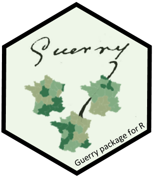

<!-- badges: start -->
[](https://www.tidyverse.org/lifecycle/#stable)
[](https://cran.r-project.org/package=Guerry)
[](https://cran.r-project.org/package=Guerry)
[](https://zenodo.org/badge/latestdoi/133678938)

<!-- badges: end -->

# Guerry 

**Version**: 1.8.0

The `Guerry` package comprises maps of France in 1830, multivariate data from A.-M. Guerry and others, and statistical and 
	graphic methods related to Guerry's *Moral Statistics of France*. The goal is to facilitate the exploration and
	development of statistical and graphic methods for multivariate data in a geo-spatial context of historical interest.
	The package stems from Friendly (2007).


## Installation


You can install Guerry from CRAN or the development version as follows:

|:------------------|:------------------------------------------------|
| CRAN version      | `install.packages("Guerry")`                    |
| Devel version     | `remotes::install_github("friendly/Guerry")`    |
|-------------------|-------------------------------------------------|


## Data sets

The Guerry package contains the following data sets:

|<div style="width:60px">Name</div>| Description |
|:-----|:------------|
| `gfrance`  | Map of France in 1830 with the `Guerry` data. It is a `SpatialPolygonsDataFrame` object created with the `sp` package.|
| `gfrance85`| The same for the 85 departments excluding Corsica|
| `Guerry`   | A collection of 'moral variables' on the 86 departments of France around 1830 from Guerry (1833) and other sources.|
| `Angeville`| Data from d'Angeville (1836) on the population of France.|

## Examples

Guerry was most interested in determining whether the occurrence of crimes
was related to literacy or other "moral variables".  But the idea of
correlation had not been invented, and he was not aware of the
idea of a scatterplot. 

Plotting crimes against persons vs. Literacy ("% who can read & write").
In this base R version, we might want to code the point symbols 
and colors by regions of France.

``` r
data(Guerry)

plot(Crime_pers ~ Literacy, data=Guerry,
	col=Region, 
	pch=(15:19)[Region],
	ylab = "Pop. per crime against persons",
	xlab = "Percent who can read & write"
	)

legend(x="bottomright", 
	legend = c("Center", "East", "North", "South", "West"), 
	pch = 15:19,
	col = as.factor(levels(Guerry$Region)))
```


Now try this with a data ellipse, and a regression line. This version also uses a
a `loess` smooth and labels the 8 most outlying departments.

``` r
library(car)
with(Guerry,{
  dataEllipse(Literacy, Crime_pers,
      levels = 0.68,
      ylim = c(0,40000), xlim = c(0, 80),
      ylab="Pop. per crime against persons",
      xlab="Percent who can read & write",
      pch = 16,
      grid = FALSE,
      id = list(method="mahal", 
                n = 8, labels=Department, location="avoid", cex=1.2),
      center.pch = 3, center.cex=5,
      cex.lab=1.5)
      
  dataEllipse(Literacy, Crime_pers,
      levels = 0.95, add=TRUE,
      ylim = c(0,40000), xlim = c(0, 80),
      lwd=2, lty="longdash",
      col="gray",
      center.pch = FALSE
      )

  abline( lm(Crime_pers ~ Literacy), lwd=2)	
  lines(loess.smooth(Literacy, Crime_pers), col="red", lwd=3)
  }
  	)
```


## Vignettes

The vignette, _Guerry data: Spatial Multivariate Analysis_, written by Stéphane Dray uses his packages
`ade4` and `adegraphics` to illustrate methods for spatial multivariate data that focus on either
the multivariate aspect or the spatial one, as well as some more modern methods that integrate
these simultaneously. 

A new vignette, _Guerry data: Multivariate Analysis_, uses Guerry's data to illustrate some graphical
methods for multivariate visualization.

See:


``` r
vignette("MultiSpat", package="Guerry")
vignette("guerry-multivariate", package="Guerry")
```

## Citation

``` r
To cite package ‘Guerry’ in publications use:

  Friendly M, Dray S (2021). _Guerry: Maps, Data and Methods Related to Guerry (1833) "Moral Statistics
  of France"_. R package version 1.7.4, <https://CRAN.R-project.org/package=Guerry>.

A BibTeX entry for LaTeX users is

  @Manual{,
    title = {Guerry: Maps, Data and Methods Related to Guerry (1833) "Moral
Statistics of France"},
    author = {Michael Friendly and Stéphane Dray},
    year = {2021},
    note = {R package version 1.7.4},
    url = {https://CRAN.R-project.org/package=Guerry},
  }
```

## References

Angeville, A. d' (1836).
_Essai sur la Statistique de la Population francaise_, Paris: F. Darfour.

Friendly, M. (2007). A.-M. Guerry's Moral Statistics of France: Challenges for Multivariable Spatial Analysis.
 *Statistical Science*, **22**, 368-399. http://www.datavis.ca/papers/guerry-STS241.pdf

Friendly, M. (2007).
Supplementary materials for Andre-Michel Guerry's *Moral Statistics of France*:
Challenges for Multivariate Spatial Analysis,
http://www.datavis.ca/gallery/guerry/.
