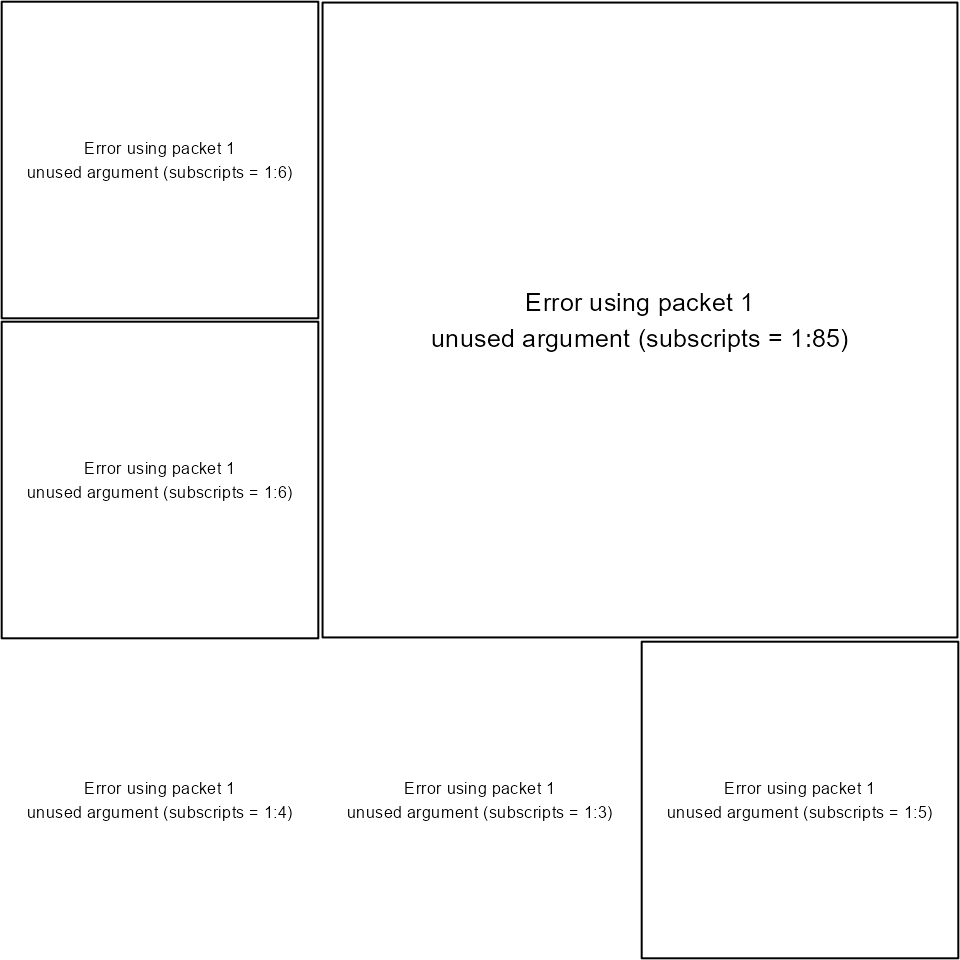

# Guerry data: Spatial Multivariate Analysis

This vignette indicates how to perform the analyses described in Dray
and Jombart ([2011](#ref-SD966)) of data derived from André-Michel
Guerry’s ([1833](#ref-SD955)) *Essai sur la Statistique Morale de la
France*. It illustrates some classical methods for analysis of
multivariate spatial data that focus *either* on the multivariate aspect
or on the spatial one, as well as some more modern methods that attempt
to integrate geographical and multivariate aspects *simultaneously*.

## Preliminary steps

Several packages are required to run the different analyses and should
be loaded. The `ade4` package for multivariate analysis is supplemented
by `adegraphics` (for associated graphical methods) and `adespatial` for
multivariate spatial analysis. For further information on this spatial
analysis approach, see
[`vignette(package="adespatial", "tutorial")`](http://adeverse.github.io/adespatial/articles/tutorial.md).

``` r
library(Guerry)       # Guerry's data
library(sp)           # management of spatial data
library(ade4)         # multivariate analysis
library(adegraphics)  # graphical representation
library(spdep)        # spatial dependency
library(adespatial)   # multivariate spatial analysis
```

Guerry gathered data on crimes, suicide, literacy and other moral
statistics for various départements (i.e., counties) in France. He
provided the first real social data analysis, using graphics and maps to
summarize this georeferenced multivariate dataset. We use the dataset
`gfrance85` and consider six key quantitative variables (shown in the
table below) for each of the 85 départements of France in 1830 (Corsica,
an island and often an outlier, was excluded).

Data are recorded on aligned scales so that **larger numbers**
consistently reflect “morally better”. Thus, four of the “bad” variables
are recorded in the inverse form, as “Population per …”. With this
scaling, it would be expected that all correlations be $\geq 0$.

| Name         | Description                                           |
|:-------------|:------------------------------------------------------|
| `Crime_pers` | Population per crime against persons                  |
| `Crime_prop` | Population per crime against property                 |
| `Literacy`   | Percent of military conscripts who can read and write |
| `Donations`  | Donations to the poor                                 |
| `Infants`    | Population per illegitimate birth                     |
| `Suicides`   | Population per suicide                                |

The dataset `gfrance85` is actually a `SpatialPolygonsDataFrame` object
created with the `sp` package. It contains the polygon boundaries of the
map of France in 1830, as well the variables in the `Guerry` data frame.
As an ordinary `data.frame`, it has these components

``` r
names(gfrance85)
#>  [1] "dept"            "Region"          "Department"      "Crime_pers"     
#>  [5] "Crime_prop"      "Literacy"        "Donations"       "Infants"        
#>  [9] "Suicides"        "MainCity"        "Wealth"          "Commerce"       
#> [13] "Clergy"          "Crime_parents"   "Infanticide"     "Donation_clergy"
#> [17] "Lottery"         "Desertion"       "Instruction"     "Prostitutes"    
#> [21] "Distance"        "Area"            "Pop1831"
```

To simplify analyses, we extract the components to be used below.

``` r
 data(gfrance85)
 gdata <- gfrance85@data                          # the Guerry data.frame
 vars <- c("Crime_pers", "Crime_prop", "Literacy", "Donations", "Infants", "Suicides")
 df           <- gdata[, vars]                    # the 6 variables
 france.map   <- as(gfrance85, "SpatialPolygons") # the map
 xy           <- coordinates(gfrance85)           # spatial coordinates
 dep.names    <- gdata[, "Department"]            # departement names
 region.names <- gdata[, "Region"]                # region names
 col.region   <- colors()[c(149, 254, 468, 552, 26)] # colors for region
```

## Standard approaches

In this section, we focus on classical approaches that consider either
the multivariate or the spatial aspect of the data.

### Multivariate analysis

Here we consider $p = 6$ variables measured for $n = 85$ individuals
(départements of France). As only quantitative variables have been
recorded, principal component analysis (PCA, [Hotelling
1933](#ref-SD308)) is well adapted. PCA summarizes the data by
maximizing simultaneously the variance of the projection of the
individuals onto the principal axes and the sum of the squared
correlations between the principal component and the variables.

``` r
pca <- dudi.pca(df, scannf = FALSE, nf = 3)
```

The biplot is simply obtained by

``` r
biplot(pca, plabel.cex = 0.8)
```


The first two PCA dimensions account for 35.7% and 20% ,respectively, of
the total variance.

``` r
pca$eig/sum(pca$eig) * 100
#> [1] 35.505 20.680 18.335 10.793  8.877  5.810
```

Correlations between variables and principal components can be
represented on a correlation circle. The first axis is negatively
correlated to literacy and positively correlated to property crime,
suicides and illegitimate births. The second axis is aligned mainly with
personal crime and donations to the poor.

``` r
s.corcircle(pca$co)
```


Spatial information can be added on the factorial map representing the
projections of départements on principal axes by coloring according to
colors representing the different regions of France.

``` r
s.label(pca$li, 
        ppoint.col = col.region[region.names], 
        plabel.optim = TRUE, 
        plabel.cex = 0.6)
```


Draw the map, colored by region:

``` r
s.Spatial(france.map, 
          col = col.region[region.names], 
          plabel.cex = 0)
s.class(xy, 
        region.names, 
        col = col.region, 
        add = TRUE, 
        ellipseSize = 0, starSize = 0)
```


For the first axis, the North and East are characterized by negative
scores, corresponding to high levels of literacy and high rates of
suicides, crimes against property and illegitimate births. The second
axis mainly contrasts the West (high donations to the the poor and low
levels of crime against persons) to the South.

### Spatial autocorrelation

Spatial autocorrelation statistics, such as Moran ([1948](#ref-SD455))
Coefficient (MC) and Geary ([1954](#ref-SD223)) Ratio, aim to measure
and analyze the degree of dependency among observations in a
geographical context ([Cliff and Ord 1973](#ref-SD577)).

#### The spatial weighting matrix

The first step of spatial autocorrelation analysis is to define a
spatial weighting matrix
$\mathbf{W} = \left\lbrack w_{ij} \right\rbrack$ . In the case of
Guerry’s data, we simply defined a binary neighborhood where two
départements are considered as neighbors if they share a common border.
The spatial weighting matrix is then obtained after row-standardization
(`style = "W"`):

``` r
nb <- poly2nb(gfrance85)
lw <- nb2listw(nb, style = "W")
```

We can represent this neighborhood on the geographical map:

``` r
s.Spatial(france.map, 
          nb = nb, 
          plabel.cex = 0, 
          pSp.border = "white")
```


#### Moran’s Coefficient

Once the spatial weights have been defined, the spatial autocorrelation
statistics can then be computed. Let us consider the $n$-by-1 vector
$\mathbf{x} = \left\lbrack x_{1}\cdots x_{n} \right\rbrack^{\text{T}}$
containing measurements of a quantitative variable for $n$ spatial
units. The usual formulation for Moran’s coefficient of spatial
autocorrelation ([Cliff and Ord 1973](#ref-SD577); [Moran
1948](#ref-SD455)) is
$$MC(\mathbf{x}) = \frac{n\sum_{(2)}{w_{ij}\left( x_{i} - \bar{x} \right)\left( x_{j} - \bar{x} \right)}}{\sum_{(2)}w_{ij}\sum_{i = 1}^{n}\left( x_{i} - \bar{x} \right)^{2}}{\mspace{6mu}\text{where}\mspace{6mu}}\sum_{(2)} = \sum\limits_{i = 1}^{n}\sum\limits_{j = 1}^{n}{\mspace{6mu}\text{with}\mspace{6mu}}i \neq j.$$

MC can be rewritten using matrix notation:
$$MC(\mathbf{x}) = \frac{n}{\mathbf{1}^{\text{T}}{\mathbf{W}\mathbf{1}}}\frac{\mathbf{z}^{\text{T}}{\mathbf{W}\mathbf{z}}}{\mathbf{z}^{\text{T}}\mathbf{z}},$$
where
$\mathbf{z} = \left( \mathbf{I}_{n} - \mathbf{1}_{n}\mathbf{1}_{n}^{\text{T}}/n \right)\mathbf{x}$
is the vector of centered values ($z_{i} = x_{i} - \bar{x}$) and
$\mathbf{1}_{n}$ is a vector of ones (of length $n$).

The significance of the observed value of MC can be tested by a
Monte-Carlo procedure, in which locations are permuted to obtain a
distribution of MC under the null hypothesis of random distribution. An
observed value of MC that is greater than that expected at random
indicates the clustering of similar values across space (positive
spatial autocorrelation), while a significant negative value of MC
indicates that neighboring values are more dissimilar than expected by
chance (negative spatial autocorrelation).

We computed MC for the Guerry’s dataset. A positive and significant
autocorrelation is identified for each of the six variables. Thus, the
values of literacy are the most covariant in adjacent departments, while
illegitimate births (Infants) covary least.

``` r
moran.randtest(df, lw)
#> class: krandtest lightkrandtest 
#> Monte-Carlo tests
#> Call: moran.randtest(x = df, listw = lw)
#> 
#> Number of tests:   6 
#> 
#> Adjustment method for multiple comparisons:   none 
#> Permutation number:   999 
#>         Test    Obs Std.Obs   Alter Pvalue
#> 1 Crime_pers 0.4118   6.079 greater  0.001
#> 2 Crime_prop 0.2636   4.003 greater  0.002
#> 3   Literacy 0.7176  10.216 greater  0.001
#> 4  Donations 0.3534   5.126 greater  0.001
#> 5    Infants 0.2332   3.808 greater  0.002
#> 6   Suicides 0.4874   7.486 greater  0.001
```

#### Moran scatterplot

If the spatial weighting matrix is row-standardized, we can define the
lag vector $\widetilde{\mathbf{z}} = {\mathbf{W}\mathbf{z}}$ (i.e.,
${\widetilde{z}}_{i} = \sum\limits_{j = 1}^{n}{w_{ij}x_{j}}$) composed
of the weighted (by the spatial weighting matrix) averages of the
neighboring values. Thus, we have:
$$MC(\mathbf{x}) = \frac{\mathbf{z}^{\text{T}}\widetilde{\mathbf{z}}}{\mathbf{z}^{\text{T}}\mathbf{z}},$$
since in this case $\mathbf{1}^{\text{T}}{\mathbf{W}\mathbf{1}} = n$.
This shows clearly that MC measures the autocorrelation by giving an
indication of the intensity of the linear association between the vector
of observed values $\mathbf{z}$ and the vector of weighted averages of
neighboring values $\widetilde{\mathbf{z}}$. Anselin
([1996](#ref-SD566)) proposed to visualize MC in the form of a bivariate
scatterplot of $\widetilde{\mathbf{z}}$ against $\mathbf{z}$. A linear
regression can be added to this *Moran scatterplot*, with slope equal to
MC.

Considering the Literacy variable of Guerry’s data, the Moran
scatterplot clearly shows strong autocorrelation. It also shows that the
Hautes-Alpes département has a slightly outlying position characterized
by a high value of Literacy compared to its neighbors.

``` r
x <- df[, 3]
x.lag <- lag.listw(lw, df[, 3])
moran.plot(x, lw)
text(x[5], x.lag[5], dep.names[5], pos = 1, cex = 0.8)
```


### Indirect integration of multivariate and geographical aspects

The simplest approach considered a two-step procedure where the data are
first summarized with multivariate analysis such as PCA. In a second
step, univariate spatial statistics or mapping techniques are applied to
PCA scores for each axis separately. One can also test for the presence
of spatial autocorrelation for the first few scores of the analysis,
with univariate autocorrelation statistics such as MC. We mapped scores
of the départements for the first two axes of the PCA of Guerry’s data.
Even if PCA maximizes only the variance of these scores, there is also a
clear spatial structure, as the scores are highly autocorrelated. The
map for the first axis corresponds closely to the split between *la
France éclairée* (North-East characterized by an higher level of
Literacy) and *la France obscure*.

``` r
moran.randtest(pca$li, lw)
#> class: krandtest lightkrandtest 
#> Monte-Carlo tests
#> Call: moran.randtest(x = pca$li, listw = lw)
#> 
#> Number of tests:   3 
#> 
#> Adjustment method for multiple comparisons:   none 
#> Permutation number:   999 
#>    Test    Obs Std.Obs   Alter Pvalue
#> 1 Axis1 0.5847   8.843 greater  0.001
#> 2 Axis2 0.5614   8.015 greater  0.001
#> 3 Axis3 0.1703   2.661 greater  0.006
s.value(xy, 
        pca$li[, 1:2], 
        Sp = france.map, 
        pSp.border = "white", 
        symbol = "circle", 
        pgrid.draw = FALSE)
```


## Spatial multivariate analysis

Over the last decades, several approaches have been developed to
consider both geographical and multivariate information simultaneously.
The multivariate aspect is usually treated by techniques of
dimensionality reduction similar to PCA. On the other hand, several
alternatives have been proposed to integrate the spatial information.

### Spatial partition

One alternative is to consider a spatial partition of the study area. In
this case, the spatial information is coded as a categorical variable,
and each category corresponds to a region of the whole study area. For
instance, Guerry’s data contained a partition of France into 5 regions.

We used the between-class analysis (BCA, [Dolédec and Chessel
1987](#ref-SD148)), to investigate differences between regions. BCA
maximizes the variance between groups.

``` r
 bet <- bca(pca, region.names, scannf = FALSE, nf = 2)
```

Here, 28.8 % of the total variance (sum of eigenvalues of PCA)
corresponds to the between-regions variance (sum of the eigenvalues of
BCA).

``` r
bet$ratio
#> [1] 0.2942
```

The main graphical outputs are obtained by the generic `plot` function:

``` r
plot(bet)
```



The barplot of eigenvalues indicates that two axes should be
interpreted. The first two BCA dimensions account for 59 % and 30.2 %,
respectively, of the between-regions variance.

``` r
 barplot(bet$eig)
```


``` r
 bet$eig/sum(bet$eig) * 100
#> [1] 58.841 30.543  7.078  3.538
```

The coefficients used to construct the linear combinations of variables
are represented:

``` r
s.arrow(bet$c1, plabel.cex = 0.8)
```


The first axis opposed literacy to property crime, suicides and
illegitimate births. The second axis is mainly aligned with personal
crime and donations to the poor.

Projections of départements on the BCA axes can be represented on the
factorial map:

``` r
s.label(bet$ls, 
        as.character(dep.names), 
        ppoint.cex = 0, 
        plabel.optim = TRUE, 
        plabel.col = col.region[region.names], plabel.cex = 0.5)
s.class(bet$ls, 
        fac = region.names, 
        col = col.region, ellipse = 0, add = TRUE)
```


The scores can be mapped to show the spatial aspects:

``` r
s.value(xy, 
        bet$ls, 
        symbol = "circle", 
        Sp = france.map, 
        pSp.col = col.region[region.names], pSp.border = "transparent")
```


The results are very close to those obtained by PCA: the first axis
contrasted the North and the East (*la France éclairée*) to the other
regions while the South is separated from the other regions by the
second axis. The high variability of the region Centre is also
noticeable. In contrast, the South is very homogeneous.

### Spatial explanatory variables

Principal component analysis with respect to the instrumental variables
(PCAIV, [Rao 1964](#ref-SD540)), and related methods, have been often
used in community ecology to identify spatial relationships. The spatial
information is introduced in the form of spatial predictors and the
analysis maximized the “spatial variance” (i.e., the variance explained
by spatial predictors). Note that BCA can also be considered as a
particular case of PCAIV, where the explanatory variables are dummy
variables indicating group membership.

#### Trend surface of geographic coordinates

Student ([1914](#ref-SD626)) proposed to express observed values in time
series as a polynomial function of time, and mentioned that this could
be done for spatial data as well. Borcard, Legendre, and Drapeau
([1992](#ref-SD59)) extended this approach to the spatial and
multivariate case by introducing polynomial functions of geographic
coordinates as predictors in PCAIV. We call this approach PCAIV-POLY.

The centroids of départements of France were used to construct a
second-degree orthogonal polynomial.

``` r
poly.xy <- orthobasis.poly(xy, degree = 2)
s.value(xy, poly.xy, Sp = france.map, plegend.drawKey = FALSE)
```


PCAIV is then performed using the `pcaiv` function:

``` r
pcaiv.xy <- pcaiv(pca, poly.xy, scannf = FALSE, nf = 2)
```

Here, 32.4 % of the total variance (sum of eigenvalues of PCA) is
explained by the second-degree polynomial (sum of eigenvalues of PCAIV).
The first two dimensions account for 51.4 % and 35.2 %, respectively, of
the explained variance.

``` r
sum(pcaiv.xy$eig)/sum(pca$eig) * 100
#> [1] 32.59
pcaiv.xy$eig/sum(pcaiv.xy$eig) * 100
#> [1] 51.888 35.392  5.375  4.828  2.517
```

The outputs of PCAIV-POLY (coefficients of variables, maps of
départements scores, etc.) are very similar to those obtained by BCA.
They can be represented easily by the generic `plot` function:

``` r
plot(pcaiv.xy)
```


#### Moran’s eigenvector maps

An alternative way to build spatial predictors is by the diagonalization
of the spatial weighting matrix **W**. Moran’s eigenvector maps (MEM,
[Dray, Legendre, and Peres-Neto 2006](#ref-SD163)) are the $n - 1$
eigenvectors of the doubly-centered matrix **W**. They are orthogonal
vectors with a unit norm maximizing MC ([Griffith 1996](#ref-SD264)).
MEM associated with high positive (or negative) eigenvalues have high
positive (or negative) autocorrelation. MEM associated with eigenvalues
with small absolute values correspond to low spatial autocorrelation,
and are not suitable for defining spatial structures.

We used the spatial weighting matrix defined above to construct MEM. The
first ten MEM, corresponding to the highest levels of spatial
autocorrelation, have been mapped:

``` r
mem1 <- scores.listw(lw)
s.value(xy, mem1[, 1:9], Sp = france.map, plegend.drawKey = FALSE)
```


We introduced the first ten MEM as spatial explanatory variables in
PCAIV. We call this approach PCAIV-MEM.

``` r
pcaiv.mem <- pcaiv(pca, mem1[,1:10], scannf = FALSE)
```

Here, 44.1 % of the total variance (sum of eigenvalues of PCA) is
explained by the first ten MEM (sum of eigenvalues of PCAIV). The first
two dimensions account for 54.9 % and 26.3 %, respectively, of the
explained variance.

``` r
sum(pcaiv.mem$eig)/sum(pca$eig) * 100
#> [1] 44.97
pcaiv.mem$eig/sum(pcaiv.mem$eig) * 100
#> [1] 55.569 26.394  8.682  4.444  3.383  1.528
```

The outputs of PCAIV-MEM (coefficients of variables, maps of
départements scores, etc.) are very similar to those obtained by BCA.
They can be represented easily by the generic `plot` function:

``` r
plot(pcaiv.mem)
```


### Spatial graph and weighting matrix

The MEM framework introduced the spatial information into multivariate
analysis through the eigen-decomposition of the spatial weighting
matrix. Usually, we consider only a part of the information contained in
this matrix because only a subset of MEM are used as regressors in
PCAIV. In this section, we focus on multivariate methods that consider
the spatial weighting matrix under its original form.

Wartenberg ([1985](#ref-SD694)) was the first to develop a multivariate
analysis based on MC. His work considered only normed and centered
variables (i.e., normed PCA) for the multivariate part and a binary
symmetric connectivity matrix for the spatial aspect. Dray, Saïd, and
Débias ([2008](#ref-SD807)) generalized Wartenberg’s method by
introducing a row-standardized spatial weighting matrix in the analysis
of a statistical triplet. This approach is very general and allows us to
define spatially-constrained versions of various methods (corresponding
to different triplets) such as correspondence analysis or multiple
correspondence analysis. MULTISPATI finds coefficients to obtain a
linear combination of variables that maximizes a compromise between the
classical multivariate analysis and a generalized version of Moran’s
coefficient.

``` r
 ms <- multispati(pca, lw, scannf = FALSE)
```

The main outputs of MULTISPATI can be represented easily by the generic
`plot` function:

``` r
plot(ms)
```


The barplot of eigenvalues suggests two main spatial structures.
Eigenvalues of MULTISPATI are the product between the variance and the
spatial autocorrelation of the scores, while PCA maximizes only the
variance. The differences between the two methods are computed by the
`summary` function:

``` r
summary(ms)
#> 
#> Multivariate Spatial Analysis
#> Call: multispati(dudi = pca, listw = lw, scannf = FALSE)
#> 
#> Scores from the initial duality diagram:
#>       var   cum  ratio  moran
#> RS1 2.130 2.130 0.3550 0.5847
#> RS2 1.241 3.371 0.5619 0.5614
#> RS3 1.100 4.471 0.7452 0.1703
#> 
#> Multispati eigenvalues decomposition:
#>        eig   var  moran
#> CS1 1.3356 2.032 0.6572
#> CS2 0.7194 1.213 0.5933
```

Hence, there is a loss of variance compared to PCA (2.14 versus 2.017
for axis 1; 1.201 versus 1.177 for axis 2) but a gain of spatial
autocorrelation (0.551 versus 0.637 for axis 1; 0.561 versus 0.59 for
axis 2).

Coefficients of variables allow to interpret the structures:

``` r
s.arrow(ms$c1, plabel.cex = 0.8)
```


The first axis opposes literacy to property crime, suicides and
illegitimate births. The second axis is aligned mainly with personal
crime and donations to the poor. The maps of the scores show that the
spatial structures are very close to those identified by PCA. The
similarity of results between PCA and its spatially optimized version
confirm that the main structures of Guerry’s data are spatial.

Spatial autocorrelation can be seen as the link between one variable and
the lagged vector. This interpretation is used to construct the Moran
scatterplot and can be extended to the multivariate case in MULTISPATI
by analyzing the link between scores and lagged scores:

``` r
s.match(ms$li, ms$ls, plabel.cex = 0)
s.match(ms$li[c(10, 41, 27), ], ms$ls[c(10, 41, 27), ], label = dep.names[c(10, 
     41, 27)], plabel.cex = 0.8, add = TRUE)
```


Each département can be represented on the factorial map by an arrow
(the bottom corresponds to its score, the head corresponds to its lagged
score. A short arrow reveals a local spatial similarity (between one
plot and its neighbors) while a long arrow reveals a spatial
discrepancy. This viewpoint can be interpreted as a multivariate
extension of the local index of spatial association ([Anselin
1995](#ref-SD565)). For instance: \* Aude has a very small arrow,
indicating that this département is very similar to its neighbors. \*
Haute-Loire has a long horizontal arrow which reflects its high values
for the variables Infants (31017), Suicides (163241) and Crime_prop
(18043) compared to the average values over its neighbors (27032.4,
60097.8 and 10540.8 for these three variables). \* Finistère corresponds
to an arrow with a long vertical length which is due to its high values
compared to its neighbors for Donations (23945 versus 12563) and
Crime_pers (29872 versus 25962).

The link between the scores and the lagged scores (averages of neighbors
weighted by the spatial connection matrix) can be mapped in the
geographical space. For the first two axes, we have:

``` r
s.value(xy, ms$li, Sp = france.map)
```


## Conclusions

Even if the methods presented are quite different in their theoretical
and practical viewpoints, their applications to Guerry’s dataset yield
very similar results. We provided a quantitative measure of this
similarity by computing Procrustes statistics ([Peres-Neto and Jackson
2001](#ref-SD516); [Dray, Chessel, and Thioulouse 2003](#ref-SD161))
between the scores of the départements onto the first two axes for the
different analyses. All the values of the statistic are very high and
significant; this confirms the high concordance between the outputs of
the different methods.

``` r
mat <- matrix(NA, 4, 4)
mat.names <- c("PCA", "BCA", "PCAIV-POLY", "PCAIV-MEM", "MULTISPATI")
colnames(mat) <- mat.names[-5]
rownames(mat) <- mat.names[-1]

mat[1, 1] <- procuste.randtest(pca$li[, 1:2], bet$ls[, 1:2])$obs
mat[2, 1] <- procuste.randtest(pca$li[, 1:2], pcaiv.xy$ls[, 1:2])$obs
mat[3, 1] <- procuste.randtest(pca$li[, 1:2], pcaiv.mem$ls[, 1:2])$obs
mat[4, 1] <- procuste.randtest(pca$li[, 1:2], ms$li[, 1:2])$obs
mat[2, 2] <- procuste.randtest(bet$ls[, 1:2], pcaiv.xy$ls[, 1:2])$obs
mat[3, 2] <- procuste.randtest(bet$ls[, 1:2], pcaiv.mem$ls[, 1:2])$obs
mat[4, 2] <- procuste.randtest(bet$ls[, 1:2], ms$li[, 1:2])$obs
mat[3, 3] <- procuste.randtest(pcaiv.xy$ls[, 1:2], pcaiv.mem$ls[, 1:2])$obs
mat[4, 3] <- procuste.randtest(pcaiv.xy$ls[, 1:2], ms$li[, 1:2])$obs
mat[4, 4] <- procuste.randtest(pcaiv.mem$ls[, 1:2], ms$li[, 1:2])$obs

mat
#>               PCA    BCA PCAIV-POLY PCAIV-MEM
#> BCA        0.9858     NA         NA        NA
#> PCAIV-POLY 0.9762 0.9904         NA        NA
#> PCAIV-MEM  0.9894 0.9942     0.9954        NA
#> MULTISPATI 0.9877 0.9952     0.9947    0.9985
```

## References

Anselin, L. 1995. “Local Indicators of Spatial Association.”
*Geographical Analysis* 27: 93–115.

———. 1996. “The Moran Scatterplot as an ESDA Tool to Assess Local
Instability in Spatial Association.” In *Spatial Analytical Perspectives
on GIS*, edited by M. M. Fischer, H. J. Scholten, and D. Unwin, 111–25.
London: Taylor; Francis.

Borcard, D., P. Legendre, and P. Drapeau. 1992. “Partialling Out the
Spatial Component of Ecological Variation.” *Ecology* 73: 1045–55.

Cliff, A. D., and J. K. Ord. 1973. *Spatial Autocorrelation*. London:
Pion.

Dolédec, S., and D. Chessel. 1987. “Rythmes Saisonniers Et Composantes
Stationnelles En Milieu Aquatique I- Description d’un Plan
d’observations Complet Par Projection de Variables.” *Acta Oecologica -
Oecologia Generalis* 8 (3): 403–26.

Dray, S., D. Chessel, and J. Thioulouse. 2003. “Procrustean Co-Inertia
Analysis for the Linking of Multivariate Data Sets.” *Ecoscience* 10
(1): 110–19.

Dray, S., and T. Jombart. 2011. “Revisiting Guerry’s Data: Introducing
Spatial Constraints in Multivariate Analysis.” *Annals of Applied
Statistics* 5 (4): 2278–99.

Dray, S., P. Legendre, and P. R. Peres-Neto. 2006. “Spatial Modeling: A
Comprehensive Framework for Principal Coordinate Analysis of Neighbor
Matrices (PCNM).” *Ecological Modelling* 196: 483–93.

Dray, S., S. Saïd, and F. Débias. 2008. “Spatial Ordination of
Vegetation Data Using a Generalization of Wartenberg’s Multivariate
Spatial Correlation.” *Journal of Vegetation Science* 19: 45–56.

Geary, R. C. 1954. “The Contiguity Ratio and Statistical Mapping.” *The
Incorporated Statistician* 5 (3): 115–45.

Griffith, D. A. 1996. “Spatial Autocorrelation and Eigenfunctions of the
Geographic Weights Matrix Accompanying Geo-Referenced Data.” *Canadian
Geographer* 40 (4): 351–67.

Guérry, A. M. 1833. *Essai Sur La Statistique Morale de La France*.
Paris: Crochard.

Hotelling, H. 1933. “Analysis of a Complex of Statistical Variables into
Principal Components.” *Journal of Educational Psychology* 24: 417–41.

Moran, P. A. P. 1948. “The Interpretation of Statistical Maps.” *Journal
of the Royal Statistical Society Series B-Methodological* 10: 243–51.

Peres-Neto, P. R., and D. A. Jackson. 2001. “How Well Do Multivariate
Data Sets Match? The Advantages of a Procrustean Superimposition
Approach over the Mantel Test.” *Oecologia* 129: 169–78.

Rao, C. R. 1964. “The Use and Interpretation of Principal Component
Analysis in Applied Research.” *Sankhya A* 26: 329–59.

Student, W. S. 1914. “The Elimination of Spurious Correlation Due to
Position in Time or Space.” *Biometrika* 10: 179–80.

Wartenberg, D. 1985. “Multivariate Spatial Correlation: A Method for
Exploratory Geographical Analysis.” *Geographical Analysis* 17 (4):
263–83.
