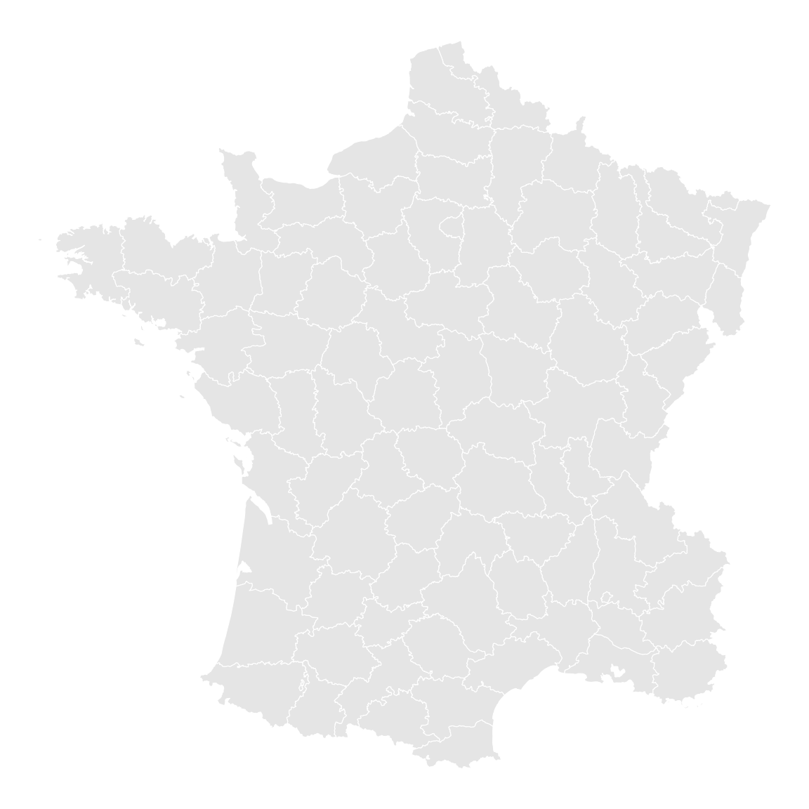
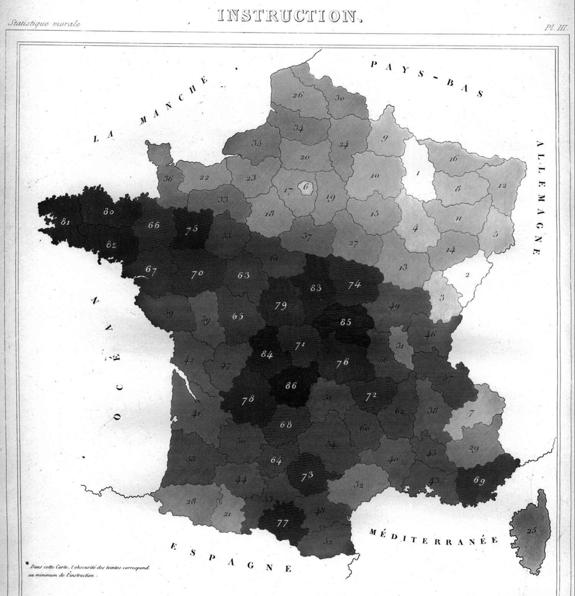
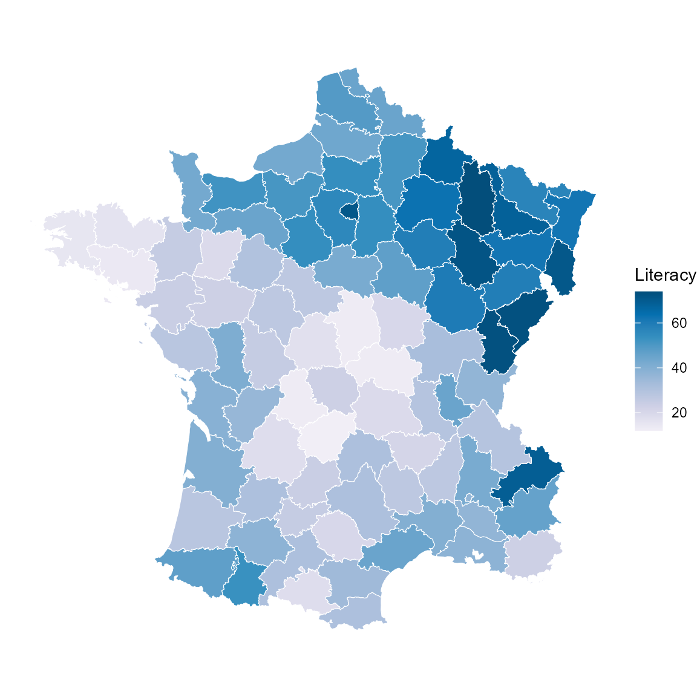
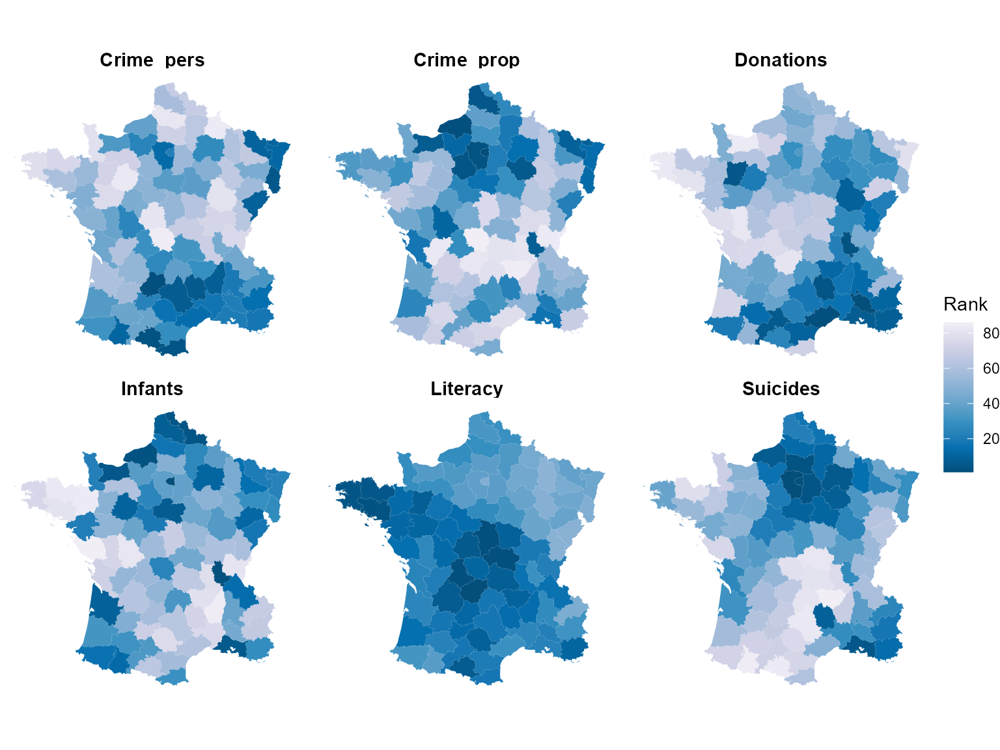
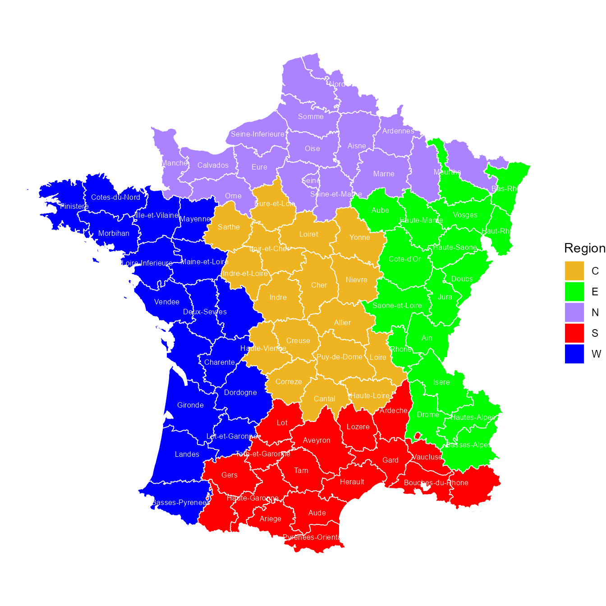

# Guerry data: Maps with sf and ggplot2

The maps in this package (`gfrance`, `gfrance85`) were originally built
as `sp` `SpatialPolygonsDataFrame` objects, and the other vignettes and
the README use the older
[`sp::spplot()`](https://edzer.github.io/sp/reference/spplot.html)
function to display them. The current standard toolchain for spatial
visualization in R is the [`sf`](https://r-spatial.github.io/sf/)
package, together with
[`ggplot2::geom_sf()`](https://ggplot2.tidyverse.org/reference/ggsf.html).
This short vignette shows how to work with Guerry’s map data that way.

This doesn’t replace the
`sp`/[`spplot()`](https://edzer.github.io/sp/reference/spplot.html)
examples used elsewhere in the package – both remain fully supported –
it’s simply the modern alternative for anyone building on `Guerry`’s map
data in a `ggplot2` workflow.

``` r
library(Guerry)
library(sf)
library(ggplot2)
library(dplyr)
library(tidyr)
data(gfrance85)
data(Guerry_ranks)
```

## Converting to `sf`

Converting the package SpatialPolygons `sp` object to use the Simple
Features, `sf`, representation is a single call to
[`sf::st_as_sf()`](https://r-spatial.github.io/sf/reference/st_as_sf.html):

``` r
gf_sf <- st_as_sf(gfrance85)
class(gf_sf)
#> [1] "sf"         "data.frame"
names(gf_sf)
#>  [1] "dept"            "Region"          "Department"      "Crime_pers"     
#>  [5] "Crime_prop"      "Literacy"        "Donations"       "Infants"        
#>  [9] "Suicides"        "MainCity"        "Wealth"          "Commerce"       
#> [13] "Clergy"          "Crime_parents"   "Infanticide"     "Donation_clergy"
#> [17] "Lottery"         "Desertion"       "Instruction"     "Prostitutes"    
#> [21] "Distance"        "Area"            "Pop1831"         "geometry"
```

The result is an ordinary data frame – all the usual `Guerry` variables
are still there as columns – with one addition: a `geometry`
list-column, where each row holds the polygon (or multi-polygon)
boundary for that department as an `sfc` object, instead of a separate
`@polygons` slot as in the `sp` representation.

Because it’s just a data frame, it can be manipulated with the usual
tools (`dplyr`, `tidyr`, …) before plotting, and
[`geom_sf()`](https://ggplot2.tidyverse.org/reference/ggsf.html) knows
to look for a `geometry` column automatically.

We’re using `gfrance85` here (rather than `gfrance`), so Corsica –
geographically distant from the mainland and excluded from the `Region`
classification – is not shown in any of the maps below.

## A basic map

[`geom_sf()`](https://ggplot2.tidyverse.org/reference/ggsf.html) handles
the geometry column automatically to draw the map. There’s no need to
supply `x`/`y` aesthetics. You can supply attributes like `fill` and
`color`. For maps,
[`theme_void()`](https://ggplot2.tidyverse.org/reference/ggtheme.html)
is often the most sensible choice for overall styling.

``` r
ggplot(gf_sf) +
  geom_sf(fill = "grey90", color = "white") +
  theme_void()
```



## Choropleth maps

Mapping a **variable** to `fill` gives a choropleth map, shading the
departments according to the values of that variable. This is a good
example of how the “Grammar of Graphics” (Wilkinson
([1999](#ref-Wilkinson:99))) helps you think about the task that Guerry
worked on for each of his maps, laboriously translating the values of a
moral variable into visible tints.

In this example, `Literacy` (percent of military conscripts who could
read and write) is mapped to a `PuBu` palette, the same one used
elsewhere in this package. `Literacy` is one of the variables Guerry
recorded so that a **higher** value is **morally better**; following the
convention of his own (black-and-white) maps, where “worse” printed
darker, `direction = -1` makes low (bad) values dark and high (good)
values light.

This isn’t just an assumed convention – it’s exactly what Guerry says
himself. His original 1833 map of the closely related `Instruction`
variable (Plate III of the *Statistique morale*) carries this footnote:
*“Dans cette carte, l’obscurité des teintes correspond au minimum de
l’instruction”* – “In this map, the darkness of the tints corresponds to
the minimum of instruction \[literacy\]”:



``` r
ggplot(gf_sf) +
  geom_sf(aes(fill = Literacy), color = "white", linewidth = 0.2) +
  scale_fill_distiller(palette = "PuBu", direction = -1, name = "Literacy") +
  theme_void()
```



The historically low-literacy departments of Brittany and central France
stand out as the darkest; the generally more literate northeast is
lightest – the same departments that are darkest in Guerry’s own
hand-tinted map above.

Note that the numbers on Guerry’s map are *his own* rank labels for
`Instruction`, where 1 is the best (lightest) department – the opposite
direction from `Guerry_ranks` in this package (see below), which is
worth keeping in mind if you compare the two directly.

## Small multiples of the main variables

The package README shows a static image of six choropleth maps of
Guerry’s main “moral variables”. Here is a living, code-generated
version of the same idea, using
[`facet_wrap()`](https://ggplot2.tidyverse.org/reference/facet_wrap.html)
and the pre-ranked `Guerry_ranks` data set.

`Guerry_ranks` gives each variable’s plain ascending rank
([`dplyr::dense_rank()`](https://dplyr.tidyverse.org/reference/row_number.html),
so ties share a rank and the maximum rank can be less than 86): rank 1
is always the **smallest** raw value, and the largest rank is the
**largest** raw value. Because these variables are already recoded so
that a larger raw value is morally better (as above), rank 1 is the
*worst* department on that variable, and the highest rank is the *best*
– the reverse of the raw-value case, even though it’s the same
underlying idea. To keep “worse = dark, better = light” consistent with
the previous figure, `direction` has to flip along with it:
`direction = -1` on the rank scale makes the low rank (worst) dark and
the high rank (best) light.

``` r
main_vars <- c("Crime_pers", "Crime_prop", "Literacy", "Donations", "Infants", "Suicides")

ranks_sf <- gf_sf |>
  select(dept) |>
  left_join(Guerry_ranks |> select(dept, all_of(main_vars)), by = "dept") |>
  pivot_longer(cols = all_of(main_vars), names_to = "variable", values_to = "rank")

ggplot(ranks_sf) +
  geom_sf(aes(fill = rank), color = NA) +
  facet_wrap(~ variable) +
  scale_fill_distiller(palette = "PuBu", direction = -1, name = "Rank") +
  theme_void() +
  theme(strip.text = element_text(size = 11, face = "bold"))
```



Comparing the `Literacy` panel here with the single-variable choropleth
above confirms the two now agree: the same departments read dark (worse)
and light (better) in both.

## Region map with department labels

Finally, a map colored by `Region`, with department names added via
[`geom_sf_text()`](https://ggplot2.tidyverse.org/reference/ggsf.html) –
the `sf`/`ggplot2` equivalent of the
[`plot()`](https://rdrr.io/r/graphics/plot.default.html) +
[`text()`](https://rdrr.io/r/graphics/text.html) approach used for this
same map in the README.

``` r
col.region <- colors()[c(149, 254, 468, 552, 26)]  # same colors used in the README

ggplot(gf_sf) +
  geom_sf(aes(fill = Region), color = "white", linewidth = 0.3) +
  geom_sf_text(aes(label = Department, color = Region == "W"),
               size = 3.2, check_overlap = TRUE) +
  scale_color_manual(values = c(`FALSE` = "black", `TRUE` = "white"), guide = "none") +
  scale_fill_manual(values = col.region) +
  theme_void()
```



## Next steps

A themed, styled version of these maps using the historical color
palettes and patterns of the
[`ggCheysson`](https://github.com/friendly/ggCheysson) package is
planned once that package reaches CRAN.

## References

Wilkinson, Leland. 1999. *The Grammar of Graphics*. New York: Springer.
