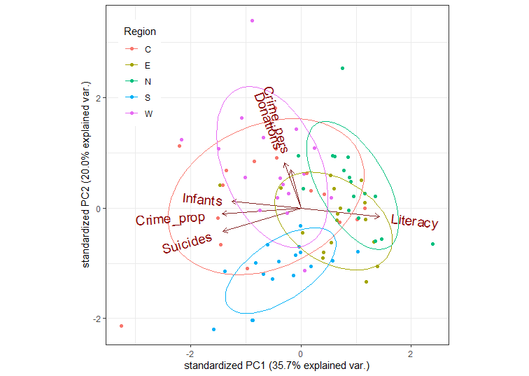
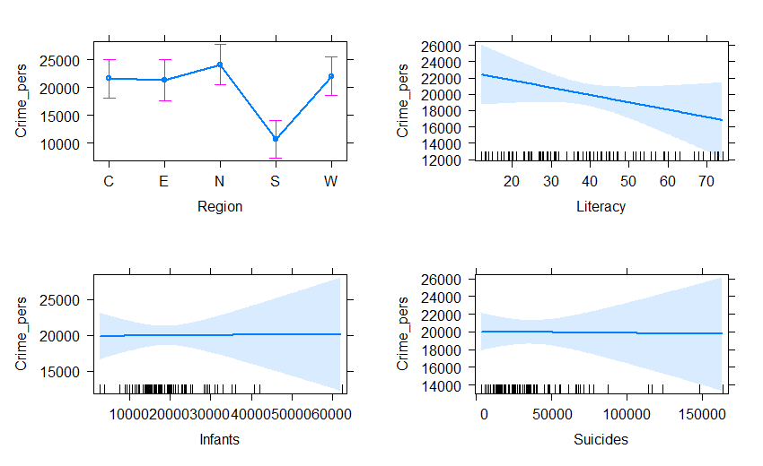
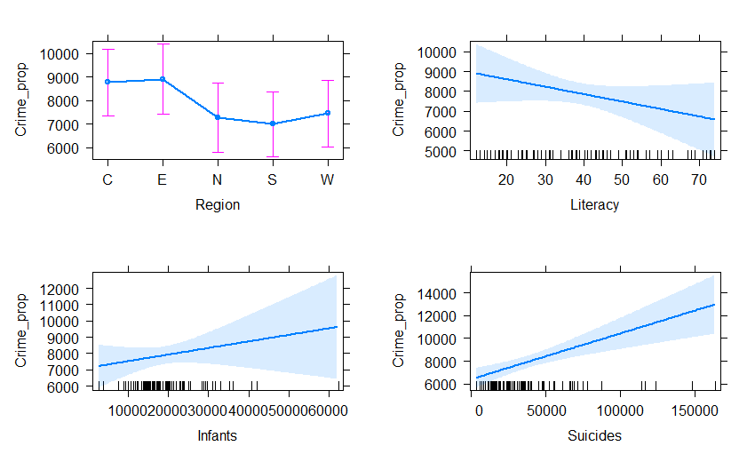

```{r setup, include = FALSE}
knitr::opts_chunk$set(
  collapse = TRUE,
  warning = FALSE,
  message = FALSE,   # suppress package loading messages
  comment = "#>",
  fig.height = 5,
  fig.width = 5,
  dpi = 96
)

# packages to be cited here. Code at the end automatically updates packages.bib
to.cite <- c("car", "effects", "ggplot2", "GGally", "ggbiplot")

```

André-Michel Guerry's _Essai sur la Statistique Morale de la France_ [@Guerry:1833]
collected data on crimes, suicide, literacy and other "moral statistics" for various départements
in France. He provided the first real social data analysis, using graphics and maps to summarize this
multivariate dataset. One of his main goals in this ground-breaking study was to determine if the prevalence
of crime in France could be explained by other social variables.

In 1833, the scatterplot had not yet been invented; the idea of a correlation or a regression was still 50 years
in the future [@Galton:1886]. Guerry displayed his data in shaded choropleth maps and semi-graphic tables
and argued how these could be seen as implying systematic, lawful relations among moral variables.

In this analysis, we ignore the spatial context of the départements and focus on multivariate analyses of the
the data set.

# Load data and packages

We will primarily use the following packages, so load them now.
```{r load}
library(Guerry)         # Guerry data
library(car)            # better scatterplots
library(effects)        # Effect Displays for Linear Models
library(ggplot2)        # Elegant Data Visualisations Using the Grammar of Graphics
library(ggrepel)        # better handling of text labels
library(patchwork)      # combine plots
library(heplots)        # Hypothesis-Error plots
library(candisc)        # Visualizing Generalized Canonical Discriminant Analysis
library(dplyr)          # A Grammar of Data Manipulation
library(tidyr)          # Tidy Messy Data
data(Guerry)
```

## `Guerry` data set

Guerry's (1833) data consisted of six main moral variables shown in the table below. 
He wanted all of these to be recorded on aligned scales so that **larger** numbers consistently
reflected "**morally better**". Thus, four of the variables are recorded in the inverse form,
as "Population per ...".


| Name        | Description                                          |
|:------------|:-----------------------------------------------------|
|`Crime_pers` | Population per crime against persons                 |
|`Crime_prop` | Population per crime against property                |
|`Literacy`   | Percent of military conscripts who can read and write|
|`Donations`  | Donations to the poor                                |
|`Infants`    | Population per illegitimate birth                    |
|`Suicides`   | Population per suicide                               |

The `Guerry` data set also contains:

* `dept` and `Department`, the French ID numbers and names for the 86 départements of metropolitan France in 1830, including Corsica.
* `Region`: a factor with main levels "N", "S", "E", "W", "C". Corsica is coded as `NA`.
* A collection of 14 other related variables from other sources at the same time. See `?Guerry` for their precise definitions.

```{r guerry-more-vars}
names(Guerry)[-(1:9)]
```

Among these, as other aspects of criminal behavior,  we see crime against parents,  `Infanticide` and `Prostitutes`. `Clergy` and `Donations_clergy` are considered to be measures of moral rectitude,
potentially counteracting crime.

## Guerry's questions

The main questions that concerned Guerry were whether indicators of crime could be shown to be related to factors
which might be considered to ameliorate crime. Among these, Guerry focused most on `Literacy` defined as the
number of military conscripts who could do more than mark an "X" on their enrollment form.
A related variable is `Instruction`, the rank recorded from Guerry's map;
as defined, it is inversely related to `Literacy`.

Other potential explanatory variables are:

: `Donations`   (a measure of donations to the poor),
: `Donation_clergy` (a measure of donations to clergy)
: `Clergy` (the rank of number of Catholic priests in active service, per population)


# Multivariate visualization methods

Visualization methods for multivariate data take an enormous variety of forms simply because more than two dimensions of data offer exponentially increasingly possibilities.  It is useful to distinguish several broad categories:

* __data plots__ : primarily plot the raw data, often with annotations to aid interpretation (regression lines and smooths, data ellipses, marginal distributions)

* __model plots__ : primarily plot the results of a fitted model, considering that
the fitted model may involve more variables than can be shown in a static 2D plot.
Some examples are: Added variable plots, effect plots, coefficient plots, ...

* __diagnostic plots__ : indicating potential problems with the fitted model. These include residual plots, influence plots, plots for testing homogeneity of variance and so forth.

* __dimension reduction plots__ : plot representations of the data into a space of fewer dimensions than the number of variables in the data set. Simple examples include principal components analysis (PCA) and the related biplots,
and multidimensional scaling (MDS) methods.

# Data plots

Data plots portray the data in a space where the coordinate axes are the observed variables.

*   1D plots include line plots, histograms and density estimates
*   2D plots are most often scatterplots, but contour plots or hex-binned plots are also useful when the sample size is large.
*   For higher dimensions, biplots, showing the data in principal components space, together with vectors representing the correlations among variables, are often the most useful.

<!-- ```{r child = "../man/partials/_ggradar.Rmd"} -->
<!-- ``` -->

## Density plots

It is useful to examine the distributions of the variables and **density** plots are 
quite informative. I want to do this for each of the 6 main variables, so I'll use
this trick of tidy data analysis with `ggplot2`:

1. Reshape the data from wide to long. This gives `guerry_long`, where the different variables are in a column labeled `variable` and the values are in `value`.


```{r guerry-long}
data("Guerry", package="Guerry")
guerry_long <- Guerry |>
  filter(!is.na(Region)) |>
  select(dept:Suicides) |>
  pivot_longer(cols = Crime_pers:Suicides,
               names_to = "variable",
               values_to = "value")
guerry_long
```

2. Plot the density, but make a different subplot by `facet_wrap(~ variable)`. These plots all have different scales for the X and Y (density) values, so it is important to use `scales="FREE"`.
Moreover, I'm primarily interested in the **shape** of these distributions, so I suppress the Y
axis tick marks and labels.

```{r guerry-density1}
#| out.width = "100%"
ggplot(data = guerry_long,
       aes(x=value, fill=TRUE)) +
  geom_density(alpha=0.2) +
  geom_rug() +
  facet_wrap(~variable, scales="free") +
  theme_bw(base_size = 14) +
  theme(legend.position = "none",
        axis.ticks.y=element_blank(),
        axis.text.y=element_blank())
```

You can see that all variables are positively skewed, `Donations`, `Infants` and `Suicides` particularly so, but not so much as to cause alarm.

It is also of interest to see whether and how these distributions differ according to `Region`.
This is easy to do, using `aes(... fill=Region)`

```{r guerry-density2}
#| out.width = "100%",
#| fig.height = 6
col.region   <- colors()[c(149, 254, 468, 552, 26)] # colors for region
ggplot(data = guerry_long,
       aes(x=value, fill=Region)) +
  geom_density(alpha=0.2) +
  geom_rug() +
  facet_wrap(~variable, scales="free") +
  scale_fill_manual(values=col.region) +
  theme_bw(base_size = 14) +
  theme(legend.position = "bottom",
        axis.ticks.y=element_blank(),
        axis.text.y=element_blank())

```
For some variables, like `Infants` and `Suicides` the differences do not seem particularly
large.  However, both crime variables and `Literacy` show marked differences across region.

## Bivariate relations

Let's start with plots of crime (`Crime_pers` and `Crime_prop`) in relation to `Literacy`.
A simple scatterplot is not very informative. All that can be seen is that there is not much of a relation between personal crime and literacy.

```{r lit-pers-scat0}
ggplot(aes(x=Literacy, y=Crime_pers/1000), data=Guerry) +
  geom_point(size=2) 

```


More useful scatterplots are annotated with additional
statistical summaries to aid interpretation:

* linear regression line,
* smoothed non-parametric (loess) curve, to diagnose potential non-linear relations,
* data ellipses, to highlight the overall trend and variability,
* point labels for potentially outlying or influential points.

I use `ggplot2` here.  It provides most of these features, except that
to label unusual points, I calculate the Mahalanobis squared distance
of all points from the grand means.

```{r lit-pers-scat}
gdf <- Guerry[, c("Literacy", "Crime_pers", "Department")]
gdf$dsq <- mahalanobis(gdf[,1:2], colMeans(gdf[,1:2]), cov(gdf[,1:2]))

ggplot(aes(x=Literacy, y=Crime_pers/1000, label=Department), data=gdf) +
  geom_point(size=2) +
  stat_ellipse(level=0.68, color="blue", size=1.2) +  
  stat_ellipse(level=0.95, color="gray", size=1, linetype=2) + 
  geom_smooth(method="lm", formula=y~x, fill="lightblue") +
  geom_smooth(method="loess", formula=y~x, color="red", se=FALSE) +
  geom_label_repel(data = gdf[gdf$dsq > 4.6,]) +
  theme_bw()
```

The flat (blue) regression line and the nearly circular data ellipses show that the correlation is nearly zero; the smoothed (red) curve indicates that there is no tendency for a nonlinear relation.

Doing the same for crimes against property:
```{r lit-prop-scat}
gdf <- Guerry[, c("Literacy", "Crime_prop", "Department")]
gdf$dsq <- mahalanobis(gdf[,1:2], colMeans(gdf[,1:2]), cov(gdf[,1:2]))

ggplot(aes(x=Literacy, y=Crime_prop/1000, label=Department), data=gdf) +
  geom_point(size=2) +
  stat_ellipse(level=0.68, color="blue", size=1.2) +  
  stat_ellipse(level=0.95, color="gray", size=1, linetype=2) + 
  geom_smooth(method="lm", formula=y~x, fill="lightblue") +
  geom_smooth(method="loess", formula=y~x, color="red", se=FALSE) +
  geom_label_repel(data = gdf[gdf$dsq > 4.6,]) +
  theme_bw()
```

So, somewhat surprisingly, increased literacy is associated with an increase in property crime
(greater population per crime) as opposed to the situation with personal crime, which seems unrelated
to literacy.
Creuse again stands out as an unusual point, one that is likely to be influential in regression models.

## Reconnaisance plots

Reconnaisance plots attempt to give a bird's-eye overview of a multivariate data set.
For example, to see the relations among more than two variables we could turn to a
scatterplot matrix or some other display to show all pairwise bivariate relations. 


For these, my preferred package is `car` [@R-car] with the `scatterplotMatrix` function.
`GGally` [@R-GGally] works within the the `ggplot2` framework, but doesn't have the flexibility
I'd like.

```{r spm1}
#| out.width="100%",
#| echo=-1
par(mar=rep(2,4))
library(car)          # Companion to Applied Regression
scatterplotMatrix(Guerry[,4:9],
                  ellipse=list(levels=0.68), 
                  smooth=FALSE)
```

### Corrgrams

Sometimes, particularly with more variables than this, we want to see a more schematic overview.  
A _correlation diagram_ or "corrgram" [@Friendly:02:corrgram] is a graphic display of a correlation
matrix, allowing different renderings of the correlation between each pair of variables:
as a shaded box, a pie symbol, a schematic data ellipse, and other options.
This is implemented in the `corrgram` package [@R-corrgram].
The panels in the
upper and lower triangles can be rendered differently.

```{r corrgram1}
#| echo=-1
par(mar=rep(1,4)+.1)
library(corrgram)             # Plot a Correlogram
corrgram(Guerry[,4:9], upper=panel.pie)
```

Or, the data in each pairwise tile can be rendered with data ellipses and
smoothed curves to show possible nonlinear relations.

Another feature is that the rows/column variables can be permuted to 
put similar variables together, using the `order` option, which arranges the
variables according to similarity of their correlations. 


```{r corrgram2}
#| echo=-1
par(mar=rep(1,4)+.1)
corrgram(Guerry[,4:9], 
         upper=panel.ellipse, 
         order=TRUE,
         lwd=2)
```

Here, there are a number of
pairwise plots that appear markedly nonlinear. For the main crime variables, the most
nonlinear are that of personal crime vs. donations to the poor, and property crime vs.
infants born out of wedlock and suicides.
`Literacy` stands out here as having negative relations with all other variables.


An alternative analysis might include:

* converting the data to ranks.
* considering transformations of some of the variables


## Biplots

Rather than viewing the data in **data space**, a biplot shows the data in the **reduced-rank PCA space** that explains most of the variation of the observations.  This is essentially a plot of the observation scores on the first principal component overlaid with vectors representing the variables projected into PCA space.

First, we use `prcomp()` to carry out the PCA. We'd like to visualize the result in relation to `Region`, so
delete Corsica where `Region` is missing.

```{r guerry.pca}
gdata <- Guerry |>
  select(Region, Crime_pers:Suicides) |>   # keep only main variables
  filter(!is.na(Region))                   # delete Corsica (Region==NA)

guerry.pca <- gdata |>
  select(-Region) |>
  prcomp(scale = TRUE)

print(guerry.pca, digits=3)

```

<!-- A screeplot shows the proportions of variance accounted for by each component. The results show that only 65% -->
<!-- of the variance is accounted for in two dimensions. -->

<!-- ```{r fig.height=4, fig.width=7} -->
<!-- ggs1 <- ggscreeplot(guerry.pca) + theme_bw() + geom_point(size=4) -->
<!-- ggs2 <- ggscreeplot(guerry.pca, type="cev") + theme_bw() + geom_point(size=4) -->
<!-- ggs1 + ggs2 -->
<!-- ``` -->

In the `ggplot2` framework, biplots can be produced by the `ggbiplot` package [@R-ggbiplot], but this package is not on
CRAN, so cannot be directly used in this vignette. Instead, the code below was run locally and the result
included.
```{r biplot1}
#| eval=FALSE
if(!require(ggbiplot)) remotes::install_github("vqv/ggbiplot")
library(ggbiplot) # A ggplot2 based biplot
ggbiplot(guerry.pca, groups=gdata$Region, 
         ellipse=TRUE,
         var.scale = 3, varname.size = 5) + 
  theme_bw() + 
  labs(color="Region") +
  theme(legend.position = c(0.1, 0.8))
```
```{r ggbiplot}

```


This is OK, but there are many features of such plots that cannot be customized (line widths, colors, ... ). I prefer
those created using the `heplots` package.

```{r biplot2, out.width="95%"}
op <- par(mar=c(5,4,1,1)+.1)
cols = colorspace::rainbow_hcl(5)
covEllipses(guerry.pca$x, 
            group=gdata$Region, 
            pooled=FALSE, 
            fill=TRUE, fill.alpha=0.1,
            col=cols, 
            label.pos=c(3,0,1,1,3), 
            cex=2,
            xlim=c(-4,4), ylim=c(-4,4),
            xlab = "Dimension 1 (35.7 %)", 
            ylab = "Dimension 2 (20.0 %)",
            cex.lab=1.4
            )
points(guerry.pca$x, pch=(15:19)[Guerry$Region], col=cols[Guerry$Region])

candisc::vectors(guerry.pca$rotation, scale=5,  
                 col="black", lwd=3, cex=1.4, 
                 pos = c(4,2,4,2,2,2),
                 xpd=TRUE)
abline(h=0, v=0, col=gray(.70))
```

An interpretation can be read from both the directions of the variable arrows and the 
relative positions of the ellipses representing the scatter of the component scores
for the different regions.

* The first component is largely aligned positively with `Literacy` and negatively with
property crime, suicides and children born out of wedlock (`Infants`)
* The second dimension reflects mainly the correlation of personal crime and donations to
the poor.
* The South region is generally lower on PC2, the West, generally higher.
* The North stands out as being higher than the others on PC1; the West somewhat higher on PC2.


# Models

Here we illustrate:

* Model based plots for linear regression models predicting personal crime and property crime
* Multivariate analysis of variance (MANOVA) and HE plots for the joint relation of the crime variables to other predictors. 

## Predicting crime: Univariate regression

The simplest approach to predicting the crime variables would be to fit a separate
multiple regression to each.

```{r mra-models}
crime.mod1 <- lm(Crime_pers ~  Region + Literacy + Donations +  Infants + Suicides, data=Guerry)
crime.mod2 <- lm(Crime_prop ~  Region + Literacy + Donations +  Infants + Suicides, data=Guerry)
```

Tests for the predictors are best obtained using `car::Anova()` which gives **partial** (Type II)
tests, adjusting for other predictors, 
rather than the **sequential** (Type I) tests provided by `stats::anova()`

```{r mra-anova}
Anova(crime.mod1)
Anova(crime.mod2)
```

These are somewhat disappointing if you look only at the significance stars:
Only `Region` is significant for personal crime and only `Suicides` for property crime.
There is no evidence for the argument, supported by
the liberal hygenicists of Guerry's time, that increased `Literacy` would reduce crime.

For such models, we can understand the nature of the predicted effects using the
`effects` package. The (marginal) effect for a given term gives the predicted values,
averaging over all other terms in the model.

```{r mra-effect1-code}
#| eval=FALSE
plot(predictorEffects(crime.mod1, ~ Region + Literacy + Infants + Suicides), 
     lwd=2, main="")
```
```{r mra-effect1}
#| echo = FALSE

```

Doing the same for property crime, we get:

```{r mra-effect2-code}
#| eval=FALSE
plot(predictorEffects(crime.mod2, ~ Region + Literacy + Infants + Suicides), 
     lwd=2, main="")
```
```{r mra-effect2}
#| echo = FALSE

```


## Predicting crime: Multivariate regression

The two regression models can be fit together in a multivariate regression for both
crime variables jointly.

```{r manova1}
crime.mod <- lm(cbind(Crime_pers, Crime_prop) ~ 
                Region + Literacy + Donations +  Infants + Suicides, data=Guerry)
Anova(crime.mod)
```

As a quick check on the assumption that the residuals are bivariate normally distributed
and a check for outliers, a $\chi^2$ Q-Q plot graphs the squared Mahalanobis distances
of the residuals against the corresponding $\chi^2_2$ quantiles these would have in a
bivariate normal distribution. The data for Creuse stands out as a potential outlier.

```{r cqplot}
#| echo=-1
par(mar=c(3,3,1,1)+.1)
labels <- paste0(Guerry$dept,":", Guerry$Department)
cqplot(crime.mod, id.n=4, labels=labels)
```

### HE plots
Hypothesis-Error (HE) plots [@Friendly:2007:heplots; @FoxFriendlyMonette:09:compstat; @heplots] provide a convenient graphical summary of hypothesis tests in multivariate linear model. They plot a data ellipse for the residuals in the model, representing the $\mathbf{E}$ matrix in the test statistics (Roy's maximum root test,
Pillai and Hotelling trace criteria and Wilks' Lambda). Overlaid on this are $\mathbf{H}$
ellipses for each term in the model, representing the data ellipses for the fitted values.
Using Roy's test, these have a convenient interpretation: a term is significant _iff_ the
H ellipse projects anywhere outside the E ellipse. For a 1 df (regression) variable, the
H ellipse collapses to a line.

```{r heplot}
#| echo=-1
par(mar = c(3,3,1,1)+.1)
heplot(crime.mod, 
       fill=TRUE, fill.alpha=0.05, 
       cex=1.4, cex.lab=1.3 )
```

In this plot, the effect of `Suicides` is completely aligned with crimes against property.
The effect of `Region` is positively correlated with both types of crime. The means
for the regions show that the South of France is lower (worse) on personal crime; the other
regions vary most in property crime, with the North being lower and the Center being higher.

### Canonical plots
The HE plot displays these relations in **data space**. An alternative is provided by 
canonical discriminant analysis, which finds the weighted sums of the response variables
leading to the largest test statistics for the terms, which can be visualized in
**canonical space**.

The analysis below reflects the effect of `Region` in relation to both crime variables.

```{r candisc}
crime.can <- candisc(crime.mod)
crime.can
```

The HE plot for this analysis is shown below. Variable vector represent the correlations
of the crime variables with the canonical dimension.
```{r hecan}
#| echo=-1
par(mar = c(3,3,1,1)+.1)
heplot(crime.can, fill=TRUE, fill.alpha=0.1,
       var.col = "black", 
       var.cex = 1.3,
       cex=1.4, cex.lab=1.3)
```

This gives a simple interpretation of the differences in `Region` on the crime variables.
The first canonical dimension accounts for 83% of differences among the regions,
and this is nearly perfectly aligned with personal crime, with the largest difference
between the South and the other regions. The second canonical dimension, accounting
for the remaing 17%, is perfectly aligned with property crime.  On this dimension,
the North stands out compared to the other regions.

```{r write-bib, echo = FALSE}
# write a packages.bib file of the packages (.packages()) that have been used here
pkgs <- unique(c(to.cite, .packages()))
knitr::write_bib(pkgs, file = here::here("vignettes", "packages.bib"))
```

# References


